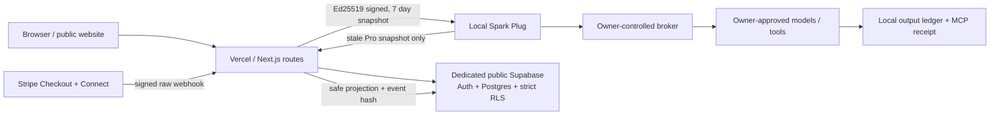

# Public launch architecture

The hosted service is a deliberately separate public account, catalog, forum,
and billing plane. It never becomes the authority for local models, agent
sessions, prompts, or generated outputs, and it never shares a database or
credential with the private product.

## Request and trust boundaries

- **Community local use has no account heartbeat.** Core access is compiled into
  the local program. Missing entitlement state means Community and does not
  trigger an authentication or entitlement request. Community may create
  unlimited local profiles and browse/download the catalog, but has no hosted
  publishing slot at launch.
- **Pro is a signed snapshot.** At startup, the local client verifies an existing
  Ed25519 token against cached public keys. It refreshes only when explicitly
  requested or within the stale window. Tokens live for at most seven days.
- **Verification is not a subscription.** `community`, `verified_creator`,
  `verified_business`, and `gameworlds_official` are service-reviewed trust
  classes. An unverified Pro publisher can offer profiles but receives a visible
  `unverified-creator` warning. Creator/business verification expires and must
  be manually revalidated; an expired class is projected as Community.
- **Catalog and manifest delivery are split.** The cacheable catalog contains
  metadata, digest, creator class, and risk labels only. Free manifests have a
  cacheable route; paid manifests require ownership or a paid order and are
  `private, no-store`.

## Vercel / Next.js

- App Router serves the existing cinematic story, legal pages, cached catalog,
  entitlement refresh, validated profile-draft submission, manifest delivery,
  and the Stripe webhook boundary.
- Server-only modules own Supabase service-role access, Stripe webhook secrets,
  and entitlement signing keys. None may use a `NEXT_PUBLIC_` prefix.
- `PAYMENTS_MODE=disabled` is the source default. Merely configuring a secret
  does not enable payments.
- Responses avoid tokens, event bodies, email addresses, manifests, and local
  paths in logs or errors. Authorization failures for paid profiles collapse to
  a generic not-found response.

## Dedicated public Supabase

The two migrations define and lock down:

- `profiles` with service-managed creator class;
- `setup_listings` for public metadata and immutable
  `setup_profile_versions` for separately authorized manifests;
- `subscriptions`, `orders`, and `creator_payout_accounts` as webhook-managed
  provider projections;
- `forum_posts`, `forum_comments`, and `forum_votes`, with owner writes,
  moderation state, edit re-review, and no public voter identity access;
- `moderation_actions` and `security_audit_log` as service-only records;
- `stripe_webhook_receipts` as leased idempotency records containing a payload
  hash but never the raw event;
- `billing_price_catalog` as an owner-configured allowlist, empty and inactive
  by default.

Every sensitive/new table has RLS enabled and forced. Client grants are narrowed
to owner-controlled columns. Publication, verification, moderation, entitlement
state, payouts, order state, and immutable profile versions remain service-only.

## Profile publication boundary

Profile manifests are declarative data, never plug-ins:

1. Validate with `schemas/setup-profile.v1.schema.json` and the stricter runtime
   validator.
2. Reject executable commands, scripts, environment/secret fields, credentials,
   URLs, absolute/traversal paths, embedded data, output references, and unknown
   keys.
3. Accept model files only from Hugging Face repository IDs pinned to a full
   40-character revision, with a SHA-256 checksum for every declared file.
4. Canonicalize and hash the exact manifest. Store it as an immutable version.
5. Moderate and attach risk labels. Only a reviewed server path can point a
   listing at that version and publish it.
6. The local installer revalidates the schema, digest, exact HF revision and
   file checksums, then asks the owner before any download or local mutation.

## Stripe and Connect

The webhook route verifies the exact raw bytes, enforces a five-minute timestamp
window, reduces known event types to a small safe projection, and claims an event
ID before applying it. A ten-minute lease permits recovery after a process crash;
fresh concurrent delivery receives a retry response, while processed duplicates
return success without repeating writes.

Checkout creation and Connect onboarding remain intentionally gated until the
owner supplies approved prices, fees, refund/tax terms, and redirect origins.
Server routes must create provider objects from database-owned amounts and IDs;
browser-supplied prices, plans, owners, or entitlement claims are never trusted.

## Local product boundary

This site may deliver a scrubbed public profile. It never receives or stores a
local model token, executable workflow, private route, host/container path,
prompt, session, output, or customer data. Generated media remains local and is
returned to the requesting agent by the local broker/MCP contract.
