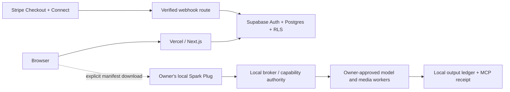

# Public launch architecture

The hosted service is a narrow account and marketplace plane. It does not become
the authority for local models, agent sessions, or render outputs.

## Vercel frontend and server routes

- Next.js App Router serves the cinematic public story, legal pages, and future
  authenticated profile pages.
- Only `NEXT_PUBLIC_SITE_URL` and the indexability flag are browser-visible.
- Supabase service-role and Stripe secrets exist only in encrypted Vercel
  environment settings and are imported only by server-only modules.
- Security headers are configured centrally. Preview deployments remain
  `noindex` until the owner sets the production launch flag.
- The waitlist route validates input, uses a honeypot, applies a Supabase-backed
  rate limit keyed by an HMAC rather than storing raw request addresses, and
  performs a duplicate-safe insert.

## Supabase data plane

- `profiles`: public/owner reads via RLS; verification is service-managed.
- `setup_listings`: public reads only for published manifests; creators can
  directly edit drafts only. Publication requires a server validation path.
- `subscriptions`: owner-readable, service-writable Stripe projection.
- `creator_payout_accounts`: owner-readable, service-writable Connect state.
- `orders`: buyer and listing-owner reads; service-only mutations.
- `stripe_events`: idempotency/audit record with payload hash, not raw payload.
- waitlist, rate-limit, and security-audit tables have no client policies.

## Stripe integration boundary

Stripe is an interface specification in this repository; it is not enabled.
When implemented:

1. Create Checkout Sessions on an authenticated server route from a fixed server
   price map. Never accept a price or entitlement from the browser.
2. Verify the raw webhook body with `STRIPE_WEBHOOK_SECRET`.
3. Insert the event ID before applying it; duplicates return success without
   repeating mutations.
4. Update subscription/order state transactionally and append a small audit row.
5. Use Stripe Connect onboarding for verified Pro+ creators. Payout capability
   comes from Stripe state, not a profile checkbox.
6. Publish marketplace fees, refunds, tax handling, and payout timing before
   enabling any paid listing.

## Local product boundary

The site may deliver a declarative, scrubbed setup manifest. The local installer
must show the manifest, verify its digest/signature, explain every dependency and
permission, and ask the owner before mutation. The website never receives local
model credentials, private agent history, host paths, or generated outputs merely
because a user installs Spark Plug.
